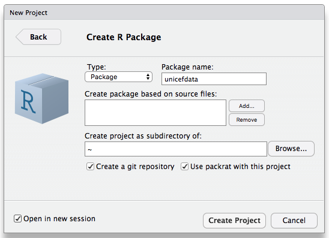

Mistakes were made in [the previous tutorial](../cleanup/).
It would be [hubris](../glossary/#hubris) to believe that we will not make more as we continue to clean this data.
What will guide us safely through these dark caverns and back into the light of day?

The answer is testing.
We must test our assumptions, test our code, test our very *being* if we are to advance.
Luckily for us,
R provides tools for this purpose not unlike those available in Python.
In order to use them,
we must first venture into the greater realm of packaging in R.

## Packaging

Unlike Python,
with its confusing plethora of packaging tools,
R has one way to do it.
Before converting our project into a package,
we will explore what a package should contain.

- The text file `DESCRIPTION` (with no suffix) holds most of the package's metadata,
  including a description of what it,
  who wrote it,
  and what other packages it requires to run.
  We will edit its contents as we go along.
- `NAMESPACE`,
  whose name also has no extension, contains the names of everything exported from the package
  (i.e., everything that is visible to the outside world).
  As we will see,
  we should leave its management in the hands of RStudio.
- Just as `.gitignore` tells Git what files in a project to ignore,
  `.Rbuildignore` tells RStudio which files it doesn't need to worry about
  when building a package from source.
- All of the R source for our package must go in a directory called `R`;
  sub-directories are not allowed.
- As you would expect from its name,
  the `data` directory contains all the data in our package.
  In order for it to be loadable as part of the package,
  the data must be saved in `.rda` format.
  We can use R's function `save` to do this
  (and use `load` in our code to restore it),
  but a better choice is to load the `usethis` library
  and call `usethis::use_data(object, overwrite = TRUE)`.
- Manual pages go in the `man` directory.
  The bad news is that they have to be in a sort-of-LaTeX format
  that is only a bit less obscure than the runes inscribed on the ancient dagger
  your colleague brought back from her latest archeological dig.
  The good news is,
  we can embed comments in our source code and use a tool called roxygen2
  to extract them and format them as required.
- The `tests` directory holds the package's unit tests.
  It should contain files with names like <code>test_<em>some_feature</em>.R</code>,
  which should in turn contain functions named <code>test_<em>something_specific</em></code>.
  We'll have a closer look at these later.

In order to understand the rest of what follows,
it's important to understand that R packages are distributed as compiled bytecode,
*not* as source code (which is how Python does it).
When a package is built,
R loads and checks the code,
then saves the corresponding instructions.
Our R files should therefore define functions,
not run commands immediately,
because if they do the latter,
those commands will be executed every time the script loads,
which is probably not what users will want.

As a side effect,
this means that if a package uses `load(something)`,
then that `load` command is executed *while the package is being compiled*,
and *not* while the compiled package is being loaded by a user after distribution.
Thus,
this simple and rather pointless "package":


```r
library(stringr)

sr <- function(text, pattern, replacement) {
  str_replace(text, pattern, replacement)
}
```

probably won't work when it's loaded by a user,
because `stringr` may not be in memory on the user's machine at the time `str_replace` is called.

How then can our packages use libraries?
The safest way is to use [fully-qualified names](../glossary/fully-qualified-name)
such as `stringr::str_replace`
every time we call a function defined somewhere outside our package.
We will explore other options below.

And while we're hedging the statements we have already made:

1. Data that *isn't* meant to be loaded directly into are should go in `inst/extdata`.
   The first part of the directory name, `inst`, is short for "install":
   when the package is installed,
   everything in this directory is bumped up a level and put in the installation directory.
   Thus,
   the installation directory will get a sub-directory called `extdata` (for "external data"),
   and that can hold whatever we want.
2. We should always put `LazyData: TRUE` in `DESCRIPTION`
   so that datasets are only loaded on demand.

## Creating a Package

We cannot turn this tutorial into an R package because we're building it as a website, not as a package.
Instead, we will create an R package called `unicefdata` to hold cleaned-up copies of
[some HIV/AIDS data][unicef-hiv] and [maternal health data][unicef-maternal] from UNICEF.

The first step is to run RStudio's project creation wizard.
We will create `unicefdata` directly under our home directory,
make it a Git repository,
and turn on Packrat (a package manager for R):



Before doing our first commit to version control,
we remove `R/hello.R` and `man/hello.Rd`
(which the project wizard helpfully provides as starting points),
and add `README.md`, `LICENSE.md`, `CONDUCT.md`, and `CITATION.md`
to describe the project as a whole,
its license,
the contributor code of conduct,
and how we want the project cited.
These files are nothing to do with R per se
(and as we'll see below, R isn't entirely happy having them here with these names),
but every project should have all four of these *somewhere*.

After committing all of this to version control,
we copy the data tidying script we wrote previous into `R/tidy_datasets.R`.
For reference,
this is what the file looks like at this point:


```r
library(tidyverse)

# Constants.
raw_filename <- "inst/extdata/infant_hiv.csv"
tidy_filename <- "/tmp/infant_hiv.csv"
first_year <- 2009
last_year <- 2017
num_rows <- 192

# Get and clean percentages.
raw <- read_csv(raw_filename, skip = 2, na = c("-"))
raw$ISO3[raw$Countries == "Kosovo"] <- "UNK"
sliced <- slice(raw, 1:num_rows)
countries <- sliced$ISO3
percents <- sliced %>%
  select(-ISO3, -Countries) %>%
  map_dfr(str_replace, pattern = ">?(\\d+)%", replacement = "\\1") %>%
  map_dfr(function(col) as.numeric(col) / 100)

# Separate three-column chunks and add countries and years.
num_years <- (last_year - first_year) + 1
chunks <- vector("list", num_years)
for (year in 1:num_years) {
  start = 3 * (year - 1) + 1
  chunks[[year]] <- select(percents, start:(start + 2)) %>%
    rename(estimate = 1, hi = 2, lo = 3) %>%
    mutate(country = countries,
           year = rep((first_year + year) - 1, num_rows)) %>%
    select(country, year, everything())
}

# Combine chunks and order by country and year.
tidy <- bind_rows(chunks) %>%
  arrange(country, year)

# Check.
write_csv(tidy, tidy_filename)
```

We're going to need to wrap this up as a function
so that these commands aren't executed while the library loads,
and we should probably also allow the user to specify the locations of the input and output files---we'll come back
and do all of this later.

First,
though,
let's edit `DESCRIPTION` and:

1. change the `Title`, `Author`, `Maintainer`, and `Description`;
2. change the `License` to [`MIT`][mit-license] (see [Choose a License][choose-a-license] for other options); and
3. go to the `Build` tab in RStudio and run 'Check` to see if our package meets CRAN's standards.

A note on this:
[CRAN][cran] is the Comprehensive R Archive Network.
Like the [Python Package Index][pypi],
it is the place to go to find the packages you need.
CRAN's rules are famously strict,
which ensures that packages run for everyone,
but which also makes package development a little more onerous than it might be.

For example,
when we run `Check`,
we get this:

```
* checking top-level files ... NOTE
Non-standard files/directories found at top level:
  ‘CITATION.md’ ‘CONDUCT.md’ ‘LICENSE.md’
...
Found the following CITATION file in a non-standard place:
  CITATION.md
Most likely ‘inst/CITATION’ should be used instead.
```

After a bit of searching online,
we rearrange these files as follows:

1. `LICENSE.md` becomes `LICENSE` with no extension (but still in the root directory).
2. The `DESCRIPTION` entry for the license is updated to `License: MIT + file LICENSE` (spelled exactly that way).
3. We add lines to `.Rbuildignore` to tell R to ignore `CITATION.md` and `CONDUCT.md`.
   We could instead move `CITATION.md` to `inst/CITATION`
   so that it will be copied into the root of the installation directory on users' machines,
   but a lot of people expect to find the citation description in the root directory of the original project.
   We could also duplicate the file,
   and once the package is mature enough to deploy,
   that might be the best answer.

These changes fix the warnings about non-standard files in non-standard places,
but we are far from done---we also have this to deal with:

```
checking for missing documentation entries ... WARNING
Undocumented code objects:
  ‘tidy_infant_hiv’
All user-level objects in a package should have documentation entries.
```

Fair enough---we want people to know what our package is for and how to use it,
so a little documentation seems like a fair request.
For this,
we turn to Hadley Wickham's *[R Packages][wickham-packages]*
and Karl Broman's "[R package primer][broman-packages]"
for advice on writing roxygen2 documentation.
We then return to our source file and wrap our existing code with this:


```r
#' Tidy up the infant HIV data set.
#'
#' @param src_path path to source file
#'
#' @return a tibble of tidy data
#'
#' @export

tidy_infant_hiv <- function(src_path) {
  # ...all the code from before...
  # Return the final tidy dataset.
  tidy
}
```

roxygen2 processes comment lines that start with `#'` (hash followed by single quote).
Putting a comment block right before a function associates that documentation with that function;
here,
we are saying that:

- the function has a single parameter called `src_path`;
- it returns a tibble of tidy data; and
- we want it exported (i.e., we want it to be visible outside the package).

Our function is now documented,
but when we run `Check`,
we still get a warning.
After a bit more searching and experimentation,
we discover that we need to load the `devtools` package
and run `devtools::document()` to regenerate documentation:
it isn't done automatically.
When we do this,
we get good news and bad news:

```
Updating unicefdata documentation
Loading unicefdata
First time using roxygen2. Upgrading automatically...
Updating roxygen version in /Users/gvwilson/unicefdata/DESCRIPTION
Warning: The existing 'NAMESPACE' file was not generated by roxygen2, and will not be overwritten.
Writing tidy_infant_hiv.Rd
```

Ah---the tutorials did warn us about this.
We need to delete `NAMESPACE` and re-run `devtools:document()`
in order to create this file:

```
# Generated by roxygen2: do not edit by hand

export(tidy_infant_hiv)
```

The comment at the start tells roxygen2 it can overwrite the file,
and reminds us that we shouldn't edit it by hand.
The `export(tidy_infant_hiv)` directive is what we really want:
as you might guess,
it tells the package builder which function to make visible.

After doing this,
we go into "Build...More...Configure build tools" and check "Generate documentation with Roxygen".
Running the build again gives us:

```
tidy_infant_hiv: no visible global function definition for ‘read_csv’
tidy_infant_hiv: no visible global function definition for ‘slice’
tidy_infant_hiv: no visible global function definition for ‘%>%’
tidy_infant_hiv: no visible global function definition for ‘select’
...several more...
tidy_infant_hiv: no visible global function definition for ‘bind_rows’
tidy_infant_hiv: no visible global function definition for ‘arrange’
Undefined global functions or variables:
  %>% Countries ISO3 arrange bind_rows country everything map_dfr
  mutate read_csv rename select slice str_replace year
```

This is the package loading problem mentioned earlier:
since our compiled-and-distributable package will only contain the bytecodes for its own functions,
direct calls to functions from other libraries won't work after the package is installed.
We will demonstrate two ways to fix this.
First,
we can add this to the roxygen2 comment block for our function:


```r
#' @import dplyr
#' @importFrom magrittr %>%
```

which tells the package builder that we want all of the functions in these two packages available.
Second (and more properly) we can change various call to use their package prefix, e.g.:

```
  percents <- sliced %>%
    select(ISO3, Countries) %>%
    purrr::map_dfr(stringr::str_replace, pattern = ">?(\\d+)%", replacement = "\\1") %>%
    purrr::map_dfr(function(col) as.numeric(col) / 100)
```

This changes the error to one that is slightly more confusing:

```
* checking package dependencies ... ERROR
Namespace dependencies not required: ‘dplyr’ ‘magrittr’

See section ‘The DESCRIPTION file’ in the ‘Writing R Extensions’
manual.
* DONE
Status: 1 ERROR
checking package dependencies ... ERROR
Namespace dependencies not required: ‘dplyr’ ‘magrittr’
```

More searching,
more experimentation,
and finally we add this to the `DESCRIPTION` file:

```
Imports:
    readr (>= 1.1.0),
    dplyr (>= 0.7.0),
    magrittr (>= 1.5.0),
    purrr (>= 0.2.0),
    rlang (>= 0.3.0),
    stringr (>= 1.3.0)
```

The `Imports` field in `DESCRIPTION` actually has nothing to do with importing functions;
it just ensures that those packages are installed when this package is.
As for the version numbers in parentheses,
we got those by running `packageVersion("readr")` and similar commands inside RStudio
and then rounding off.

All right: are we done now?
No, we are not:

```
checking R code for possible problems ... NOTE
tidy_infant_hiv: no visible binding for global variable ‘ISO3’
tidy_infant_hiv: no visible binding for global variable ‘Countries’
tidy_infant_hiv: no visible binding for global variable ‘country’
tidy_infant_hiv: no visible binding for global variable ‘year’
```

This is annoying but understandable.
When the package builder is checking our code,
it has no idea what columns are going to be in our data frames,
so it has no way to know if `ISO3` or `Countries` will cause a problem.
However,
this is just a `NOTE`, not an `ERROR`,
so we can try running "Build...Install and Restart"
to build our package,
re-start our R session (so that memory is clean),
and load our newly-created package,
and then run `tidy_infant_hiv("inst/extdata/infant_hiv.csv")`.
This produces:

```
Error in read_csv(src_path, skip = 2, na = c("-")) : 
  could not find function "read_csv"
```

After calling upon the names of Those Who Shall Not Be Named
and making a fresh cup of tea,
we re-read our code and realize that we forgot to rename `read_csv` to `readr::read_csv`.
Fixing this doesn't fix the problem with column names, though;
to do that,
we add this to the roxygen2 comment block:

```
#' @importFrom rlang .data
```

and then modify the calls that use naked column names to be:

```
    select(-.data$ISO3, -.data$Countries) %>%
    ...
    select(.data$country, .data$year, everything())
    ...
    arrange(.data$country, .data$year)
```

What is this `.data` that we have invoked?
Typing `?rlang::.data` gives us the answer:
it is a pronoun that allows us to be explicit when we refer to an object inside the data.
Adding this---i.e.,
being explicity that `country` is a column of `.data` rather than an undefined variable---finally
(finally)
gives us a clean build.

But we are not done,
because we are never *truly* done.
We still need to add our cleaned-up data to our package
and document the package as a whole.
There are three steps to this.

First, we load and clean the data, storing the cleaned tibble in a variable called `infant_hiv`,
then load the `usethis` package and called `usethis::use_data(infant_hiv)`
to store the tibble in `data/infant_hiv.rda`.
(We could just call `save` with the appropriate parameters,
but `usethis` is a useful set of tools for creating and managing R projects,
and in retrospect,
we should have started using it earlier.)
Note: we *must* save the data as `.rda`, not as (for example) `.rds` or `.csv`;
only `.rda` will be automatically loaded as part of the project.

Second,
we create a file called `R/infant_hiv.R` to hold documentation about the dataset
and put this in it:


```r
#' Tidied infant HIV data.
#'
#' This tidy data is derived from the `infant_hiv.csv` file, which in turn is
#' derived from an Excel spreadsheet provided by UNICEF - see the README.md file
#' in the raw data directory for details.
#'
#' @format A data frame
#' \describe{
#'   \item{country}{Country reporting (ISO3 code)}
#'   \item{year}{Year reported}
#'   \item{estimate}{Best estimate of rate (may be NA)}
#'   \item{hi}{High end of estimate range (may be NA)}
#'   \item{lo}{Low end of estimate range (may be NA)}
#' }
"infant_hiv"
```

Everything except the last line is a roxygen2 comment block
that describes the data in plain language,
then uses some tags and directives to document its format and fields.
(Note that we have also documented our data in `inst/extdata/README.md`,
but that focuses on the format and meaning of the raw data,
not the cleaned-up version.)

The last line is the string `"infant_hiv"`,
i.e.,
the name of the dataset.
We will create one placeholder R file like this for each of our datasets,
and each will have that dataset's name as the thing being documented.

We use a similar trick to document the package as a whole:
we create a file `R/unicefdata.R`
(i.e., a file with exactly the same name as the package)
and put this in it:


```r
#' Clean up and share some data from UNICEF on infant HIV rates and maternal mortality.
#'
#' @author Greg Wilson, \email{greg.wilson@rstudio.com}
#' @docType package
#' @name unicefdata
NULL
```

That's right:
to document the entire package,
we document `NULL`,
which is one of the few times R uses call-by-value.
(That's a fairly clumsy joke,
but honestly,
who among us is at our best at times like these?)

## Testing

The standard testing library for R is [testthat][testthat].
Like Python's [unittest][unittest] library,
it is a member of the [xUnit][xunit] family
of [unit testing](../glossary/#unit-test) libraries:

1.  Each test consists of a single function that tests a single property or behavior of the system.
2.  Tests are collected into files with prescribed names that can be found by a [test runner](../glossary/#test-runner).
3.  Shared [setup](../glossary/#testing-setup) and [teardown](../glossary/#testing-teardown) steps are put in functions of their own.

Let's load it and write our first test:


```r
library(testthat)
```

```
## 
## Attaching package: 'testthat'
```

```
## The following objects are masked from 'package:rlang':
## 
##     is_false, is_null, is_true
```

```
## The following object is masked from 'package:dplyr':
## 
##     matches
```

```
## The following object is masked from 'package:purrr':
## 
##     is_null
```

```r
test_that("Zero equals itself", {expect_equal(0, 0)})
```

As is conventional with xUnit-style testing libraries,
no news is good news:
if a test passes,
it doesn't produce output because it doesn't need our attention.
Let's try something that ought to fail:


```r
test_that("Zero equals one", {expect_equal(0, 1)})
```

```
## Error: Test failed: 'Zero equals one'
## * 0 not equal to 1.
## 1/1 mismatches
## [1] 0 - 1 == -1
```

Good:
we can draw some comfort from the fact that They have not yet changed the fundamental rules of arithmetic.
But what are the curly braces around `expect_equal` for?
The answer is that they create a code block of some sort for `test_that` to run.
We can run `expect_equal` on its own:


```r
expect_equal(0, 1)
```

```
## Error: 0 not equal to 1.
## 1/1 mismatches
## [1] 0 - 1 == -1
```

but that doesn't produce a summary of how many tests passed or failed.
Passing a block of code to `test_that` also allows us to check several things in one test:


```r
test_that("Testing two things", {
  expect_equal(0, 0)
  expect_equal(0, 1)
})
```

```
## Error: Test failed: 'Testing two things'
## * 0 not equal to 1.
## 1/1 mismatches
## [1] 0 - 1 == -1
```

Note that a block of code is *not* the same thing as an [anonymous function](../glossary/#anonymous-function),
which is why running this block of code does nothing:


```r
test_that("Using an anonymous function", function(){
  print("In our anonymous function")
  expect_equal(0, 1)
})
```

But running blocks of tests by hand is a bad practice no matter what is in them.
What we should do instead is put related tests in files,
then put those files in a directory called `tests/testthat`.
We can then run some or all of those tests with a single command.

To start,
let's create `tests/test_example.R`:


```r
library(testthat)
context("Demonstrating the testing library")

test_that("Testing a number with itself", {
  expect_equal(0, 0)
  expect_equal(-1, -1)
  expect_equal(Inf, Inf)
})

test_that("Testing different numbers", {
  expect_equal(0, 1)
})

test_that("Testing with a tolerance", {
  expect_equal(0, 0.01, tolerance = 0.05, scale = 1)
  expect_equal(0, 0.01, tolerance = 0.005, scale = 1)
})
```

The first line loads the testthat package,
which gives us our tools.
The call to `context` on the second line gives this set of tests a name for reporting purposes.
After that,
we add as many calls to `test_that` as we want,
each with a name and a block of code.
We can now run this file from within RStudio:


```r
test_dir("tests/testthat")
```

```
## ✔ | OK F W S | Context
## 
⠏ |  0       | Demonstrating the testing library
⠋ |  1       | Demonstrating the testing library
⠙ |  2       | Demonstrating the testing library
⠹ |  3       | Demonstrating the testing library
⠸ |  3 1     | Demonstrating the testing library
⠼ |  4 1     | Demonstrating the testing library
⠴ |  4 2     | Demonstrating the testing library
✖ |  4 2     | Demonstrating the testing library
## ───────────────────────────────────────────────────────────────────────────
## test_example.R:11: failure: Testing different numbers
## 0 not equal to 1.
## 1/1 mismatches
## [1] 0 - 1 == -1
## 
## test_example.R:16: failure: Testing with a tolerance
## 0 not equal to 0.01.
## 1/1 mismatches
## [1] 0 - 0.01 == -0.01
## ───────────────────────────────────────────────────────────────────────────
## 
⠏ |  0       | Finding empty rows
⠋ |  0   1   | Finding empty rows
⠙ |  0 1 1   | Finding empty rows
✖ |  0 1 1   | Finding empty rows
## ───────────────────────────────────────────────────────────────────────────
## test_find_empty_a.R:5: warning: (unknown)
## cannot open file '../scripts/find_empty_02.R': No such file or directory
## 
## test_find_empty_a.R:5: error: (unknown)
## cannot open the connection
## 1: source("../scripts/find_empty_02.R") at tests/testthat/test_find_empty_a.R:5
## 2: file(filename, "r", encoding = encoding)
## ───────────────────────────────────────────────────────────────────────────
## 
⠏ |  0       | Finding empty rows
⠋ |  0   1   | Finding empty rows
⠙ |  0 1 1   | Finding empty rows
✖ |  0 1 1   | Finding empty rows
## ───────────────────────────────────────────────────────────────────────────
## test_find_empty_b.R:5: warning: (unknown)
## cannot open file '../scripts/find_empty_02.R': No such file or directory
## 
## test_find_empty_b.R:5: error: (unknown)
## cannot open the connection
## 1: source("../scripts/find_empty_02.R") at tests/testthat/test_find_empty_b.R:5
## 2: file(filename, "r", encoding = encoding)
## ───────────────────────────────────────────────────────────────────────────
## 
⠏ |  0       | Testing properties of tibbles
⠋ |  1       | Testing properties of tibbles
✔ |  1       | Testing properties of tibbles
## 
## ══ Results ════════════════════════════════════════════════════════════════
## OK:       5
## Failed:   4
## Warnings: 2
## Skipped:  0
```

A bit of care is needed when interpreting these results.
There are four `test_that` calls,
but eight actual checks,
and the number of successes and failures is counted by recording the results of the latter,
not the former.

What then is the purpose of `test_that`?
Why not just use `expect_equal` and its kin,
such as `expect_true`, `expect_false`, `expect_length`, and so on?
The answer is that it allows us to do one operation and then check several things afterward.
Let's create another file called `tests/test_tibble.R`:


```r
library(tidyverse)
library(testthat)
context("Testing properties of tibbles")

test_that("Tibble columns are given the name 'value'", {
  t <- c(TRUE, FALSE) %>% as.tibble()
  expect_equal(names(t), "value")
})
```

(We don't actually have to call our test files `test_something.R`,
but `test_dir` and the rest of R's testing infrastructure expect us to.
Similarly,
we don't have to put them in a `tests` directory,
but gibbering incoherence is likely to ensue if we do not.)
Now let's run all of our tests:


```r
test_dir("tests/testthat")
```

```
## ✔ | OK F W S | Context
## 
⠏ |  0       | Demonstrating the testing library
⠋ |  1       | Demonstrating the testing library
⠙ |  2       | Demonstrating the testing library
⠹ |  3       | Demonstrating the testing library
⠸ |  3 1     | Demonstrating the testing library
⠼ |  4 1     | Demonstrating the testing library
⠴ |  4 2     | Demonstrating the testing library
✖ |  4 2     | Demonstrating the testing library
## ───────────────────────────────────────────────────────────────────────────
## test_example.R:11: failure: Testing different numbers
## 0 not equal to 1.
## 1/1 mismatches
## [1] 0 - 1 == -1
## 
## test_example.R:16: failure: Testing with a tolerance
## 0 not equal to 0.01.
## 1/1 mismatches
## [1] 0 - 0.01 == -0.01
## ───────────────────────────────────────────────────────────────────────────
## 
⠏ |  0       | Finding empty rows
⠋ |  0   1   | Finding empty rows
⠙ |  0 1 1   | Finding empty rows
✖ |  0 1 1   | Finding empty rows
## ───────────────────────────────────────────────────────────────────────────
## test_find_empty_a.R:5: warning: (unknown)
## cannot open file '../scripts/find_empty_02.R': No such file or directory
## 
## test_find_empty_a.R:5: error: (unknown)
## cannot open the connection
## 1: source("../scripts/find_empty_02.R") at tests/testthat/test_find_empty_a.R:5
## 2: file(filename, "r", encoding = encoding)
## ───────────────────────────────────────────────────────────────────────────
## 
⠏ |  0       | Finding empty rows
⠋ |  0   1   | Finding empty rows
⠙ |  0 1 1   | Finding empty rows
✖ |  0 1 1   | Finding empty rows
## ───────────────────────────────────────────────────────────────────────────
## test_find_empty_b.R:5: warning: (unknown)
## cannot open file '../scripts/find_empty_02.R': No such file or directory
## 
## test_find_empty_b.R:5: error: (unknown)
## cannot open the connection
## 1: source("../scripts/find_empty_02.R") at tests/testthat/test_find_empty_b.R:5
## 2: file(filename, "r", encoding = encoding)
## ───────────────────────────────────────────────────────────────────────────
## 
⠏ |  0       | Testing properties of tibbles
⠋ |  1       | Testing properties of tibbles
✔ |  1       | Testing properties of tibbles
## 
## ══ Results ════════════════════════════════════════════════════════════════
## OK:       5
## Failed:   4
## Warnings: 2
## Skipped:  0
```

That's rather a lot of output.
Happily,
we can provide a `filter` argument to `test_dir`:


```r
test_dir("tests/testthat", filter = "test_tibble.R")
```

```
## Error in test_files(paths, reporter = reporter, env = env, stop_on_failure = stop_on_failure, : No matching test file in dir
```

Ah.
It turns out that `filter` is applied to filenames *after* the leading `test_` and the trailing `.R` have been removed.
Let's try again:


```r
test_dir("tests/testthat", filter = "tibble")
```

```
## ✔ | OK F W S | Context
## 
⠏ |  0       | Testing properties of tibbles
⠋ |  1       | Testing properties of tibbles
✔ |  1       | Testing properties of tibbles
## 
## ══ Results ════════════════════════════════════════════════════════════════
## OK:       1
## Failed:   0
## Warnings: 0
## Skipped:  0
```

That's better,
and it illustrates our earlier point about the importance of following conventions.

## Warming Up {#s:warming-up}

To give ourselves something to test,
let's create a file called `scripts/find_empty_01.R`
that defines a single function `find_empty_rows` that identifies all the empty rows in a CSV file.
Our first implementation is:


```r
find_empty_rows <- function(source) {
  data <- read_csv(source)
  empty <- data %>%
    pmap(function(...) {
      args <- list(...)
      all(is.na(args) | (args == ""))
    })
  data %>%
    transmute(id = row_number()) %>%
    filter(as.logical(empty)) %>%
    pull(id)
}
```

This is complex enough to merit line-by-line exegesis:

1.  Define the function with one argument `source`, from which we shall read.
2.  Read tabular data from that source and assign the resulting tibble to `data`.
3.  Begin a pipeline that will assign something to the variable `empty`.
    1.  Use `pmap` to map a function across each row of the tibble.
        Since we don't know how many columns are in each row,
        we use `...` to take any number of arguments.
    2.  Convert the variable number of arguments to a list.
    3.  Check to see if all of those arguments are either `NA` or the empty string.
    4.  Close the mapped function's definition.
4.  Start another pipeline.
    This one's result isn't assigned to a variable,
    so whatever it produces will be the value returned by `find_empty_rows`.
    1.  Construct a tibble that contains only the row numbers of the original table in a column called `id`.
    2.  Filter those row numbers to keep only those corresponding to rows that were entirely empty.
        The `as.logical` call inside `filter` is needed because the value returned by `pmap`
        (which we stored in `empty`)
        is a list, not a logical vector.
    3.  Use `pull` to get the one column we want from the filtered tibble as a vector.

There is a lot going on here,
particularly if you are (as I am at the time of writing)
new to R
and needed help to figure out that `pmap` is the function this problem wants.
But now that we have it,
we can do this:


```r
source("scripts/find_empty_01.R")
find_empty_rows("a,b\n1,2\n,\n5,6")
```

The `source` function reads R code from the given source.
Using this inside an RMarkdown file is usually a bad idea,
since the generated HTML or PDF won't show readers what code we loaded and ran.
On the other hand,
if we are creating command-line tools for use on clusters or in other batch processing modes,
and are careful to display the code in a nearby block,
the stain on our soul is excusable.

The more interesting part of this example is the call to `find_empty_rows`.
Instead of giving it the name of a file,
we have given it the text of the CSV we want parsed.
This string is passed to `read_csv`,
which (according to documentation that only took us 15 minutes to realize we had already seen)
interprets its first argument as a filename *or*
as the actual text to be parsed if it contains a newline character.
This allows us to write put the [test fixture](../glossary/#test-fixture)
right there in the code as a literal string,
which experience shows is to understand and maintain
than having test data in separate files.

Our function seems to work,
but we can make it more pipelinesque:


```r
find_empty_rows <- function(source) {
  read_csv(source) %>%
    pmap_lgl(function(...) {
      args <- list(...)
      all(is.na(args) | (args == ""))
    }) %>%
    tibble(empty = .) %>%
    mutate(id = row_number()) %>%
    filter(empty) %>%
    pull(id)
}
```

Going line by line once again:

1.  Define a function with one argument called `source`, from which we shall once again read.
2.  Read from that source to fill the pipeline.
3.  Map our test for emptiness across each row, returning a logical vector as a result.
    (`pmap_lgl` is a derivative of `pmap` that always casts its result to logical.
    Similar functions like `pmap_dbl` return vectors of other types,
    and many other tidyverse functions have strongly-typed variants as well.)
4.  Turn that logical vector into a single-column tibble,
    giving that column the name "empty".
    We explain the use of `.` below.
5.  Add a second column with row numbers.
6.  Discard rows that aren't empty.
7.  Return a vector of the remaining row IDs.

> **Wat?**
>
> Buried in the middle of the pipe shown above is the expression:
>
> `tibble(empty = .)`
>
> Quoting from *[Advanced R][advanced-r]*,
> "The function arguments look a little quirky
> but allow you to refer to `.` for one argument functions,
> `.x` and `.y.` for two argument functions,
> and `..1`, `..2`, `..3`, etc, for functions with an arbitrary number of arguments."
> In other words, `.` in tidyverse functions usually means "whatever is on the left side of the `%>%` operator",
> i.e., whatever would normally be passed as the function's first argument.
> Without this,
> we have no easy way to give the sole column of our newly-constructed tibble a name.

Here's our first batch of tests:


```r
library(tidyverse)
library(testthat)
context("Finding empty rows")

source("../scripts/find_empty_02.R")

test_that("A single non-empty row is not mistakenly detected", {
  result <- find_empty_rows("a\n1")
  expect_equal(result, NULL)
})

test_that("Half-empty rows are not mistakenly detected", {
  result <- find_empty_rows("a,b\n,2")
  expect_equal(result, NULL)
})

test_that("An empty row in the middle is found", {
  result <- find_empty_rows("a,b\n1,2\n,\n5,6")
  expect_equal(result, c(2L))
})
```

And here's what happens when we run this file with `test_dir`:


```r
test_dir("tests/testthat", "find_empty_a")
```

```
## ✔ | OK F W S | Context
## 
⠏ |  0       | Finding empty rows
⠋ |  0   1   | Finding empty rows
⠙ |  0 1 1   | Finding empty rows
✖ |  0 1 1   | Finding empty rows
## ───────────────────────────────────────────────────────────────────────────
## test_find_empty_a.R:5: warning: (unknown)
## cannot open file '../scripts/find_empty_02.R': No such file or directory
## 
## test_find_empty_a.R:5: error: (unknown)
## cannot open the connection
## 1: source("../scripts/find_empty_02.R") at tests/testthat/test_find_empty_a.R:5
## 2: file(filename, "r", encoding = encoding)
## ───────────────────────────────────────────────────────────────────────────
## 
## ══ Results ════════════════════════════════════════════════════════════════
## OK:       0
## Failed:   1
## Warnings: 1
## Skipped:  0
```

This is perplexing:
we expected that if there were no empty rows,
our function would return `NULL`.
Let's look more closely:


```r
find_empty_rows("a\n1")
```

Ah:
we are being given an integer vector of zero length rather than `NULL`.
Let's have a closer look at the properties of this strange beast:


```r
print("is integer(0) equal to NULL")
```

```
## [1] "is integer(0) equal to NULL"
```

```r
is.null(integer(0))
```

```
## [1] FALSE
```

```r
print("any(logical(0))")
```

```
## [1] "any(logical(0))"
```

```r
any(logical(0))
```

```
## [1] FALSE
```

```r
print("all(logical(0))")
```

```
## [1] "all(logical(0))"
```

```r
all(logical(0))
```

```
## [1] TRUE
```

All right.
If we compare `c(1L, 2L)` to `NULL`, we expect `c(FALSE, FALSE)`,
so it's reasonable to get a zero-length logical vector as a result when we compare `NULL` to an integer vector with no elements.
The fact that `any` of an empty logical vector is `FALSE` isn't really surprising either---none of the elements are `TRUE`,
so it would be hard to say that any of them are.
But `all` of an empty vector being `TRUE` is…unexpected.
The reasoning is apparently that none of the (nonexistent) elements are `FALSE`,
but honestly,
at this point we are veering dangerously close to [JavaScript Logic][javascrip-wat],
so we will accept this behavior and move on.

So what *should* our function return when there aren't any empty rows: `NULL` or `integer(0)`?
After a bit of thought,
we decide on the latter,
which means it's the tests that we need to rewrite,
not the code:


```r
library(tidyverse)
library(testthat)
context("Finding empty rows")

source("../scripts/find_empty_02.R")

test_that("A single non-empty row is not mistakenly detected", {
  result <- find_empty_rows("a\n1")
  expect_equal(result, integer(0))
})

test_that("Half-empty rows are not mistakenly detected", {
  result <- find_empty_rows("a,b\n,2")
  expect_equal(result, integer(0))
})

test_that("An empty row in the middle is found", {
  result <- find_empty_rows("a,b\n1,2\n,\n5,6")
  expect_equal(result, c(2L))
})
```

And here's what happens when we run this file with `test_dir`:


```r
test_dir("tests/testthat", "find_empty_b")
```

```
## ✔ | OK F W S | Context
## 
⠏ |  0       | Finding empty rows
⠋ |  0   1   | Finding empty rows
⠙ |  0 1 1   | Finding empty rows
✖ |  0 1 1   | Finding empty rows
## ───────────────────────────────────────────────────────────────────────────
## test_find_empty_b.R:5: warning: (unknown)
## cannot open file '../scripts/find_empty_02.R': No such file or directory
## 
## test_find_empty_b.R:5: error: (unknown)
## cannot open the connection
## 1: source("../scripts/find_empty_02.R") at tests/testthat/test_find_empty_b.R:5
## 2: file(filename, "r", encoding = encoding)
## ───────────────────────────────────────────────────────────────────────────
## 
## ══ Results ════════════════════════════════════════════════════════════════
## OK:       0
## Failed:   1
## Warnings: 1
## Skipped:  0
```

## Checking Data Transformation

People normally write unit tests for the code in packages,
not to check the steps taken to clean up particular datasets,
but the latter are just as useful as the former.
To illustrate,
we have been given several more CSV files to clean up.
The first,
`at_health_facilities.csv`,
shows the percentage of births at health facilities by country, year, and mother's age.
It comes from the same UNICEF website as our previous data,
but has a different set of problems.
Here are its first few lines:

```
,,GLOBAL DATABASES,,,,,,,,,,,,,
,,[data.unicef.org],,,,,,,,,,,,,
,,,,,,,,,,,,,,,
,,,,,,,,,,,,,,,
Indicator:,Delivered in health facilities,,,,,,,,,,,,,,
Unit:,Percentage,,,,,,,,,,,,,,
,,,,Mother's age,,,,,,,,,,,
iso3,Country/areas,year,Total ,age 15-17,age 18-19,age less than 20,age more than 20,age 20-34,age 35-49,Source,Source year,,,,
AFG,Afghanistan,2010, 	33 , 	25 , 	29 , 	28 , 	31 , 	31 , 	31 ,MICS,2010,,,,
ALB,Albania,2005, 	98 , 	100 , 	96 , 	97 , 	98 , 	99 , 	92 ,MICS,2005,,,,
ALB,Albania,2008, 	98 , 	94 , 	98 , 	97 , 	98 , 	98 , 	99 ,DHS,2008,,,,
...
```

and its last:

```
ZWE,Zimbabwe,2005, 	66 , 	64 , 	64 , 	64 , 	67 , 	69 , 	53 ,DHS,2005,,,,
ZWE,Zimbabwe,2009, 	58 , 	49 , 	59 , 	55 , 	59 , 	60 , 	52 ,MICS,2009,,,,
ZWE,Zimbabwe,2010, 	64 , 	56 , 	66 , 	62 , 	64 , 	65 , 	60 ,DHS,2010,,,,
ZWE,Zimbabwe,2014, 	80 , 	82 , 	82 , 	82 , 	79 , 	80 , 	77 ,MICS,2014,,,,
,,,,,,,,,,,,,,,
Definition:,Percentage of births delivered in a health facility.,,,,,,,,,,,,,,
,"The indicator refers to women who had a live birth in a recent time period, generally two years for MICS and five years for DHS.",,,,,,,,,,,,,,
,,,,,,,,,,,,,,,
Note:,"Database include reanalyzed data from DHS and MICS, using a reference period of two years before the survey.",,,,,,,,,,,,,,
,Includes surveys which microdata were available as of April 2016. ,,,,,,,,,,,,,,
,,,,,,,,,,,,,,,
Source:,"UNICEF global databases 2016 based on DHS, MICS .",,,,,,,,,,,,,,
,,,,,,,,,,,,,,,
Contact us:,data@unicef.org,,,,,,,,,,,,,,
```

There are two other files in this collection called `c_sections.csv` and `skilled_attendant_at_birth.csv`,
which are the number of Caesarean sections
and the number of births where a midwife or other trained practitioner was present.
All three datasets have been exported from the same Excel spreadsheet;
rather than writing a separate script for each,
we should create a tool that will handle them all.

At first glance,
the problems we need to solve to do this are:

1.  Each file may have a different number of header rows
    (by inspection, two of the files have 7 and one has 8),
    so we should infer this number from the file.
2.  Each file may contain a different number of records,
    so our tool should select rows by content rather than by absolute row number.
3.  The files appear to have the same column names
    (for which we give thanks),
    but we should check this in case someone tries to use our function
    with a dataset that doesn't.

These three requirements will make our program significantly more complicated,
so we should tackle each with its own testable function.

### How Many Header Rows?

The data we care about comes after the row with `iso3`, `Country/areas`, and other column headers,
so the simplest way to figure out how many rows to skip is to read the data,
look for this row,
and discard everything above it.
The simplest way to do *that* is to read the file once to find the number of header rows,
then read it again,
discarding that number of rows.
It's inefficient,
but for a dataset this size,
simplicity beats performance.

Here's our first try:


```r
read_csv("inst/extdata/at_health_facilities.csv") %>%
  select(check = 1) %>%
  mutate(id = row_number()) %>%
  filter(check == "iso3") %>%
  select(id) %>%
  first()
```

```
## Error: 'inst/extdata/at_health_facilities.csv' does not exist in current working directory ('/Users/gvwilson/tidynomicon').
```

Ignoring the messages about missing column names,
this tells us that `iso3` appears in row 7 of our data,
which is *almost* true:
it's actually in row 8,
because `read_csv` has interpreted the first row of the raw CSV data as a header.
On the bright side,
that means we can immediately use this value as the `skip` parameter to the next `read_csv` call.

How do we test this code?
Easy:
we turn it into a function,
tell that function to stop if it can't find `iso3` in the data,
and write some unit tests.
The function is:


```r
determine_skip_rows <- function(src_path) {
  read_csv(src_path) %>%
    select(check = 1) %>%
    mutate(id = row_number()) %>%
    filter(check == "iso3") %>%
    select(id) %>%
    first()
}
```

We can then call `usethis::use_testthat()` to set up some testing infrastructure,
including the directory `tests/testthat`
and a script called `tests/testthat.R`
that will run all our tests when we want to check the integrity of our project.
Once we have done that
we can put these five tests in `tests/testthat/test_determine_skip_rows.R`:


```r
test_that("The right row is found when there are header rows", {
  result <- determine_skip_rows("a1,a2\nb1,b2\nis03,stuff\nc1,c2\n")
  expect_equal(result, 2)
})
```

```
## Error: Test failed: 'The right row is found when there are header rows'
## * `result` not equal to 2.
## Lengths differ: 0 is not 1
```

```r
test_that("The right row is found when there are header rows and blank lines", {
  result <- determine_skip_rows("a1,a2\nb1,b2\n,\nis03,stuff\nc1,c2\n,\n")
  expect_equal(result, 3)
})
```

```
## Error: Test failed: 'The right row is found when there are header rows and blank lines'
## * `result` not equal to 3.
## Lengths differ: 0 is not 1
```

```r
test_that("The right row is found when there are no header rows to discard", {
  result <- determine_skip_rows("iso3,stuff\nc1,c2\n")
  expect_equal(result, 0)
})
```

```
## Error: Test failed: 'The right row is found when there are no header rows to discard'
## * `result` not equal to 0.
## Lengths differ: 0 is not 1
```

```r
test_that("No row is found when 'iso3' isn't present", {
  expect_error(determine_skip_rows("a1,a2\nb1,b1\n"),
               "No start row found")
})
```

```
## Error: Test failed: 'No row is found when 'iso3' isn't present'
## * `determine_skip_rows("a1,a2\nb1,b1\n")` did not throw an error.
```

```r
test_that("No row is found when 'iso3' is in the wrong place", {
  expect_error(determine_skip_rows("stuff,iso3\n"),
               "No start row found")
})
```

```
## Error: Test failed: 'No row is found when 'iso3' is in the wrong place'
## * `determine_skip_rows("stuff,iso3\n")` did not throw an error.
```

That's right: all five fail.
The first problem is that we have written `is03` (with a digit `0` instead of a letter `o`) in the first two tests.
If we fix that and re-run the tests, they pass;
what about the other three?

1.  When there are no rows to skip, our function is returning `integer(0)` instead of 0
    because the row with `iso3` is being used as headers.
2.  When `iso3` isn't found at all, the function is returning `integer(0)` rather than stopping.

Here is a more robust version of the function:


```r
determine_skip_rows <- function(src_path) {
  data <- read_csv(src_path)
  if (names(data)[1] == "iso3") {
    return(0)
  }
  result <- data %>%
    select(check = 1) %>%
    mutate(id = row_number()) %>%
    filter(check == "iso3") %>%
    select(id) %>%
    first()
  if (length(result) == 0) {
    stop("No start row found in", src_path)
  }
  result
}
```

and here is the roxygen2 header and other modifications needed to make it package-worthy:


```r
#' Determine how many rows to skip at the start of a raw maternal data set.
#' This works by finding the first row with `iso3` in the first column.
#'
#' @param src_path path to source file
#'
#' @return the number of rows to skip (or halt if marker 'iso3' not found)
#'
#' @importFrom magrittr %>%
#' @importFrom rlang .data

determine_skip_rows <- function(src_path) {
  data <- readr::read_csv(src_path)
  if (names(data)[1] == "iso3") {
    return(0)
  }
  result <- data %>%
    dplyr::select(check = 1) %>%
    dplyr::mutate(id = dplyr::row_number(.data)) %>%
    dplyr::filter(.data$check == "iso3") %>%
    dplyr::select(.data$id) %>%
    first()
  if (length(result) == 0) {
    stop("No start row found in", src_path)
  }
  result
}
```

Note that this roxygen2 comment block *doesn't* include an `@export` directive,
since this function is only going to be used within our project.

The code to find the first and last row of interest looks very similar:


```r
determine_first_and_last_row <- function(data) {
  result <- data %>%
    dplyr::mutate(rownum = dplyr::row_number()) %>%
    dplyr::filter(.data$iso3 %in% c("AFG", "ZWE")) %>%
    dplyr::filter(dplyr::row_number() %in% c(1, n())) %>%
    dplyr::select(.data$rownum) %>%
    dplyr::pull(.data$rownum)
  if (length(result) != 2) {
    stop("First or last row missing")
  }
  result
}
```

as does the code to select the region of interest and reformat the numbers as fractions:


```r
subsection_maternal_data <- function(raw_data, first_and_last) {
  raw_data %>%
    slice(1:first_and_last[[2, 1]]) %>%
    select(-.data$`Country/areas`, -starts_with("X")) %>%
    purrr::map_dfr(function(x) ifelse(stringr::str_detect(x, "-"), NA, x)) %>%
    dplyr::mutate_at(vars(-c(.data$iso3, .data$Source)), as.numeric) %>%
    dplyr::mutate_at(vars(-c(.data$iso3, .data$year, .data$Source, .data$`Source year`)),
                     function(x) x / 100) %>%
    dplyr::rename(
      total = .data$Total,
      age_15_17 = .data$`age 15-17`,
      age_18_19 = .data$`age 18-19`,
      age_less_than_20 = .data$`age less than 20`,
      age_more_than_20 = .data$`age more than 20`,
      age_20_34 = .data$`age 20-34`,
      age_35_49 = .data$`age 35-49`,
      source = .data$Source,
      source_year = .data$`Source year`
    )
}
```

(We have renamed the columns whose names included spaces and dashes
so that they'll be easier for other people to use.)
We can now stitch everything together---we omit the roxygen2 header blocks for clarity:


```r
tidy_maternal_data <- function(src_path) {
  skip_rows <- determine_skip_rows(src_path)
  data <- readr::read_csv(src_path, skip = skip_rows)
  first_and_last <- determine_first_and_last_row(data)
  subsection_maternal_data(data, first_and_last)
}

regenerate_all_datasets <- function() {
  infant_hiv <- tidy_infant_hiv("inst/extdata/infant_hiv.csv")
  at_health_facilities <- tidy_maternal_data("inst/extdata/at_health_facilities.csv")
  c_sections <- tidy_maternal_data("inst/extdata/c_sections.csv")
  skilled_attendant_at_birth <- tidy_maternal_data("inst/extdata/skilled_attendant_at_birth.csv")
  usethis::use_data(
    infant_hiv,
    at_health_facilities,
    c_sections,
    skilled_attendant_at_birth,
    overwrite = TRUE
  )
}
```


