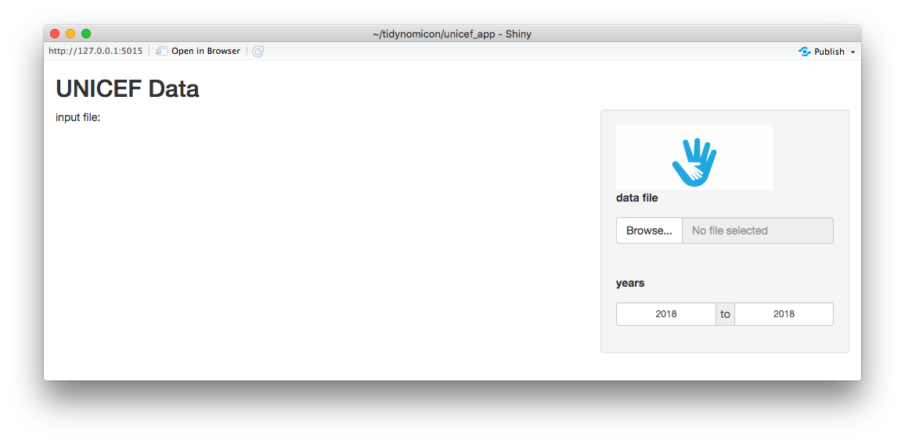
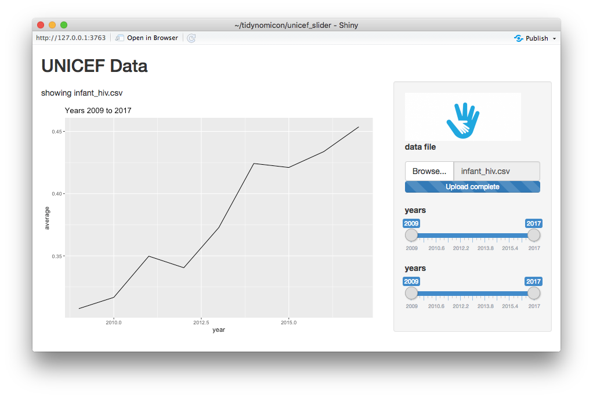

- FIXME: following <https://shiny.rstudio.com/tutorial/>
- Make sure Shiny is installed
- Make sure the built-in examples run
  - FIXME <https://github.com/rstudio/shiny/issues/2287>
- Thanks to Mine Çetinkaya-Rundel and Barret Schloerke for explaining all of this to me


```r
library(shiny)
runExample("01_hello")
```

- Every Shiny app has:
  - a user interface object (shows things to user)
  - a server function (the back end that provides data)
  - a call to `shinyApp` that binds the two together
  - can all live in the same file, though some people prefer to put the UI and server in separate files
- Let's reproduce that first example

## Setup

-   Create a directory called `faithful_app`.
    -   Every application needs to be in its own directory.)
-   Create a file in that directory called `app.R`.
    -   `runApp(directory_name)` automatically looks for `app.R`.)
-   Create the skeleton of the application


```r
library(shiny)

ui <- # ...user interface...

server <- # ...server...

shinyApp(ui = ui, server = server)
```

## The User Interface

-   The interface is a fluid page (resizes as needed)
-   Contains a single sidebar layout with two elements, `sidebarPanel` and `mainPanel`
-   The sidebar contains a `sliderInput` object that (as you'd expect from the name) creates a slider
    -   `label`, `min`, `max`, and `value` set it up
    -   `inputId` gives it a name that's used to refer to it in the server
-   There's also a `mainPanel` object that contains a single `plotOutput`
    -   Its `outputId` is used to refer to it in other code


```r
ui <- fluidPage(
  titlePanel("Hello Shiny!"),
  sidebarLayout(
    sidebarPanel(
      sliderInput(inputId = "bins",
                  label = "Number of bins:",
                  min = 1,
                  max = 50,
                  value = 30)),
    mainPanel(plotOutput(outputId = "distPlot"))
  )
)
```

## The Server

-   Something has to react to changes in controls and update displays
-   Shiny watches for the former and takes care of the latter automatically...
    -   ...but we have to tell it what to watch, what to update, and how to make those updates
-   We create a function that Shiny calls when it needs to


```r
server <- function(input, output) {
  output$distPlot <- renderPlot({
    x    <- faithful$waiting
    bins <- seq(min(x), max(x), length.out = input$bins + 1)
    hist(x, breaks = bins, col = "#75AADB", border = "white",
         xlab = "Waiting time to next eruption (in mins)",
         main = "Histogram of waiting times")
    })
}
```

-   When there is a change, Shiny notices and calls our function, giving it inputs (controls) and outputs (displays)
-   `input$bins` matches the `bins` ID for the slider, so the value of `input$bins` will be the value of the slider
-   `output$distPlot` matches the `distPlot` ID of the plot, so we can use Shiny's `renderPlot` function to tell it what to plot
    -   Can't use ggplot2 calls directly, but terminology is very similar
-   In this case:
    -   `x` axis is waiting times from the `faithful` data
    -   `bins` is the bin labels (look at `input$bins` to get value)
    -   `hist` is the histogram we want plotted

## Execution

-   Run `app.R` from the command line or use:


```r
runApp("faithful_app")
```

-   Once it's running, narrow the window to see the "fluid" part (resizing)

## The User Interface

-   Let's build a tool for exploring the UNICEF data
-   `mkdir unicef/skeleton` and create `app.R`

<!-- unicef/skeleton/app.R -->

```r
library(shiny)

ui <- fluidPage(
  titlePanel("UNICEF Data"),
  sidebarLayout(
    position = "right",
    sidebarPanel(
      img(src = "logo.png", width = 200),
      h2("Controls")
    ),
    mainPanel(h1("Display"))
  )
)

server <- function(input, output){
  # Empty for now.
}

shinyApp(ui = ui, server = server)
```


```r
knitr::include_graphics("../files/unicef_skeleton.png")
```


-   Position the controls on the right
-   Use `h1`, `h2`, and similarly-named functions to create HTML elements
-   Use `img` to display a logo
-   Empty server
-   Run it: everything looks good except the image
    -   Turns out images have to be in the `unicef/skeleton/www` folder

-   Now time to add widgets (interactive control elements)
    -   Buttons
    -   Checkboxes
    -   Radio buttons
    -   Pulldown selectors (for cases when checkboxes or radio buttons would take up too much space)
    -   Date inputs and date ranges
    -   Filenames
    -   Sliders (like the one seen before)
    -   Free-form text input
-   So we need to decide what we're going to visualize
-   Choose a date range
-   See line plot of average estimate by year
-   Also need to choose a file
-   Come back later and figure out how to constrain year input to match years in file

<!-- unicef/prototype/app.R -->

```r
ui <- fluidPage(
  titlePanel("UNICEF Data"),
  sidebarLayout(
    position = "right",
    sidebarPanel(
      img(src = "logo.png", width = 200),
      fileInput("datafile", p("data file")),
      dateRangeInput("years", p("years"), format = "yyyy")
    ),
    mainPanel(h1("Display"))
  )
)
```


```r
knitr::include_graphics("../files/unicef_prototype.png")
```


-   Let's show the chosen filename in the output display

<!-- unicef/filename_wrong/app.R -->

```r
ui <- fluidPage(
  titlePanel("UNICEF Data"),
  sidebarLayout(
    # ...as before...
    mainPanel(
      textOutput("filename")
    )
  )
)

server <- function(input, output){
  output$filename <- renderText({
    paste("input file:", input$datafile)
  })
}
```

-   Initial display looks good:


```r

```


-   Fill in filename: oops


```r
knitr::include_graphics("../files/unicef_filename_wrong_after.png")
```


-   Read the docs
    -   `input` is a named list-like object of everything set up in the interface
    -   `input$datafile` picks out one element, but it turns out that's a data frame
    -   `input$datafile$datapath` ought to get us what we want

<!-- unicef/filename_right/app.R -->

```r
server <- function(input, output){
  output$filename <- renderText({
    paste("input file:", input$datafile$datapath)
  })
}
```

-   Ah: we should show `name`, but use `datapath` when reading data
-   Let's fill in the server a bit

<!-- unicef/server/app.R -->

```r
server <- function(input, output){
  currentData <- NULL
  output$filename <- renderText({
    currentName <- input$datafile$name
    currentPath <- input$datafile$datapath
    if (is.null(currentName)) {
      currentData <- NULL
      text <- "no filename set"
    } else {
      currentData <- read_csv(currentPath)
      text <- paste("showing", currentName)
    }
    text
  })
}
```

-   Three places to put variables:
    1.  At the top of the script outside functions, they are run once when the app launches
    2.  Inside `server`, they are run once for each user
    3.  Inside a handler like `renderText`, they are run once on each change


```r
knitr::include_graphics("../files/unicef_filename_right.png")
```


## Displaying the Data in the File

-   Now comes the hard part: updating the chart when the file changes
-   Trick is to use a **[reactive variable](../glossary/#reactive-variable)**
    -   A function that changes value whenever something it depends on changes
    -   Where "something" is another reactive, like the ones provided by Shiny
-   `currentData` is created by calling `reactive` with a block of code that produces the variable's value
    -   It uses `input$datafile`, so it will automatically be triggered whenever `input$datafile` changes
    -   *And* other things can depend on it in the same way
    -   Which allows us to get rid of `currentData`
-   `output$filename` uses `currentData()`, so it is automatically called when the reactive variable's value changes

<!-- unicef/reactive_update/app.R -->

```r
server <- function(input, output){
  currentData <- reactive({
    currentPath <- input$datafile$datapath
    if (is.null(currentPath)) {
      result <- NULL
    } else {
      result <- read_csv(currentPath)
    }
    result
  })

  output$filename <- renderText({
    currentName <- input$datafile$name
    if (is.null(currentName)) {
      text <- "no filename set"
    } else {
      text <- paste("showing", currentName)
    }
    text
  })

  output$chart <- renderPlot({
    data <- currentData()
    if (is.null(data)) {
      message("no data")
      chart <- NULL
    } else {
      message("we have data, creating chart")
      chart <- data %>%
        group_by(year) %>%
        summarize(average = mean(estimate, na.rm = TRUE)) %>%
        ggplot() +
        geom_line(mapping = aes(x = year, y = average))
    }
    chart
  })
}
```


```r
knitr::include_graphics("../files/unicef_reactive_update.gif")
```


## Breaking Circular Dependencies

-   Now comes the *other* hard part: handling changes to the date range.
-   Want the chart to display data for the selected range of years
-   And have the minimum and maximum possible year set by the data
-   So add a third parameter `session` to the `server` function
-   Get the current years from `input$years`
-   And use `updateDateRangeInput` to push a change from the output function to the input controls
    -   This needs the session
-   Run this:
    -   Displays the current date twice on startup before a file selected because that's the default for the date input
    -   But once dates are entered, goes into an infinite loop
    -   The chart depends on the dates, but we're changing the dates inside the plot update

<!-- unicef/infinite_update/app.R -->

```r
server <- function(input, output, session){
  # ...other code as before...

  output$chart <- renderPlot({
    years <- input$years
    message('years', years)
    data <- currentData()
    if (is.null(data)) {
      chart <- NULL
    } else {
      minYear <- as.character(min(data$year))
      maxYear <- as.character(max(data$year))
      updateDateRangeInput(session, "years", min = minYear, max = maxYear,
                           start = minYear, end = maxYear)
      chart <- data %>%
        group_by(year) %>%
        summarize(average = mean(estimate, na.rm = TRUE)) %>%
        ggplot() +
        geom_line(mapping = aes(x = year, y = average)) +
        ggtitle(paste("Years", minYear, "-", maxYear))
    }
    chart
  })
}
```

-   Try again: just read `years` inside the chart update and display it

<!-- unicef/every_character/app.R -->

```r
  output$chart <- renderPlot({
    years <- input$years
    message('years', years)
    data <- currentData()
    if (is.null(data)) {
      chart <- NULL
    } else {
      minYear <- as.character(min(data$year))
      maxYear <- as.character(max(data$year))
      chart <- data %>%
        group_by(year) %>%
        summarize(average = mean(estimate, na.rm = TRUE)) %>%
        ggplot() +
        geom_line(mapping = aes(x = year, y = average)) +
        ggtitle(paste("Years", minYear, "-", maxYear))
    }
    chart
  })
```

-   Whoops: the message appears every time a character is typed in one of the date controls
    -   I.e., deleting the start year and typing `2`, `0`, `1`, `8`
        produces `0002`, `0020`, and `0201` before producing a usable year

-   Let's try another approach: only show the year selector when there's data
    -   And change the year selector to a double-ended slider, because seeing the day and month is misleading
-   The revised UI looks like this:

<!-- unicef/slider/app.R -->

```r
ui <- fluidPage(
  titlePanel("UNICEF Data"),
  sidebarLayout(
    position = "right",
    sidebarPanel(
      img(src = "logo.png", width = 200),
      div(
        id = "datafileInput",
        fileInput("datafile", p("data file"))
      )
    ),
    mainPanel(
      p(textOutput("filename")),
      plotOutput("chart")
    )
  )
)
```

-   Wrap the file selector in a `div` so that we have a named element after which to insert our date range selector
-   But *don't* include the date range selector (yet)

-   Outline of server is:


```r
server <- function(input, output){

  currentData <- reactive({
    # ...provide currentData...
  })
  
  selectedData <- reactive({
    # ...provide selectedData...
  })
  
  observeEvent(input$datafile, {
    # ...insert year selector when datafile changes...
  })
  
  output$chart <- renderPlot({
    # ...update chart when selectedData changes...
  })
  
  output$filename <- renderText({
    # ...update displayed filename when selected file changes...
  })
}
```

-   The zero'th change is getting rid of the `session` variable (don't need it any longer)
-   The first change is to create a reactive variable for the selected data
    -   Because the chart depends on the selected data, while the range of years we can select depends on the current (actual) data
    -   Everywhere you might need to "see" data, create a reactive variable
-   The function `observeEvent` allows us to create event handlers that aren't directly attached to display objects
    -   We need one so that we can create the year display
-   `currentData` is straightforward: if the filename changes, load that CSV file


```r
  currentData <- reactive({
    read_csv(input$datafile$datapath)
  })
```

-   `selectedData` is also straightforward: if `currentData` changes, filter by year range


```r
  selectedData <- reactive({
    req(input$years)
    currentData() %>%
      filter(between(year, input$years[1], input$years[2]))
  })
```

-   Uses `currentData()`, so Shiny knows it depends on changes to the current data
-   But how do we know we *have* a year range?
    -   `req(input$years)` means "make sure this thing exists before going any further"
    -   FIXME: how does Shiny know that `observeEvent` later down will create this element?
-   Once we have the years, we can filter

-   Now for the clever bit: create a slider *after* loading a data file
    -   Use `observeEvent(input$datafile, {...})` to indicate that this action depends on changes to the filename
    -   Get the current data, grab the year range, create a `sliderInput`, and use `insertUI` to add it after the `div` we created


```r
  observeEvent(input$datafile, {
    current <- currentData()
    lowYear <- min(current$year)
    highYear <- max(current$year)
    insertUI(
      selector = "#datafileInput",
      where = "afterEnd",
      ui = sliderInput("years", "years", 
                       min = lowYear,
                       max = highYear,
                       value = c(lowYear, highYear),
                       sep = "")
    )
  })
```

-   Creating the chart and displaying the filename is as before
    -   Though we have switched to `ifelse` for the filename's value to be idiomatic
-   Note that the chart depends on `selectedData()` and *not* the raw data


```r
  output$chart <- renderPlot({
    selectedData() %>%
      group_by(year) %>%
      summarize(average = mean(estimate, na.rm = TRUE)) %>%
        ggplot() +
        geom_line(mapping = aes(x = year, y = average)) +
        labs(title = paste("Years", input$years[1], "to", input$years[2]))
  })
  
  output$filename <- renderText({
    currentName <- input$datafile$name
    ifelse(is.null(currentName), "no filename set", paste("showing", currentName))
  })
```

-   Here are the dependencies we have created


```r
knitr::include_graphics("../files/unicef_slider_dependencies.png")
```


-   Ta da!
-   Except we're adding a slider every time we open a file
    -   So if we open the same file twice, we get two sliders with identical ranges


```r

```


## Rendering the User Interface Explicitly

-   Our last uses `uiOutput` and `renderUI` to (re-)create the slider at just the right moment
-   The UI looks familiar, except there's a `uiOutput` placeholder where the slider is to go
    -   The name `"slider"` will be used in the server


```r
ui <- fluidPage(
  titlePanel("UNICEF Data"),
  sidebarLayout(
    position = "right",
    sidebarPanel(
      img(src = "logo.png", width = 200),
      fileInput("datafile", p("data file")),
      uiOutput("slider")
    ),
    mainPanel(
      p(textOutput("filename")),
      plotOutput("chart")
    )
  )
)
#> Error in fluidPage(titlePanel("UNICEF Data"), sidebarLayout(position = "right", : could not find function "fluidPage"
```

-   `uiOutput` is always used in conjunction with `renderUI` in the server, so let's look at the server


```r
server <- function(input, output){

  currentData <- reactive({
    # ...get the data...
  })

  output$slider <- renderUI({
    # ...create a widget to allow year selection...
  })

  selectedData <- reactive({
    # ...select data using values from the year selector...
  })

  output$chart <- renderPlot({
    # ...draw the chart...
  })

  output$filename <- renderText({
    # ...display the filename...
  })
}
```

-   What does `currentData` look like?


```r
  currentData <- reactive({
    req(input$datafile)
    read_csv(input$datafile$datapath)
  })
#> Error in reactive({: could not find function "reactive"
```

-   We use `req(...)` to tell Shiny that there's no point proceeding unless `input$datafile` actually has a value
    -   Because we can't load data if we have a `NULL` filename
    -   FIXME: why wasn't this check required before?

-   What do we do once we have data?
    -   We create a slider, or overwrite the existing slider if there already is one
    -   This prevents the problem of multiple sliders
    -   Note that the slider's ID is `"years"`, and that its range is set based on data
    -   So we avoid the problem of having to create a slider when we don't know what its range should be


```r
  output$slider <- renderUI({
    current <- currentData()
    lowYear <- min(current$year)
    highYear <- max(current$year)

    sliderInput("years", "years",
                     min = lowYear,
                     max = highYear,
                     value = c(lowYear, highYear),
                     sep = "")
  })
#> Error in renderUI({: could not find function "renderUI"
```

-   What do we do once we have a slider?
    -   Select the data
    -   This depends on the years from the slider, so we make that explicit using `req`


```r
  selectedData <- reactive({
    req(input$years)

    currentData() %>%
      filter(between(year, input$years[1], input$years[2]))
  })
#> Error in reactive({: could not find function "reactive"
```

-   Displaying the chart and the filename are exactly as we've seen before
    -   The chart depends on `selectedData`
    -   The filename display depends on `input$datafile$name`

-   When the UI is initially created:
    -   There is no data file, so `req(input$datafile)` in the definition of `currentData` halts
    -   Without `currentData`, the `renderUI` call used to create the slider doesn't proceed
    -   So the UI doesn't get a slider and doesn't try to display data it doesn't have
-   When a filename is selected for the first time
    -   `input$datafile` gets a value
    -   So we load data *and* we can display the filename
    -   `currentData` turns green because we have loaded data
    -   So we can create a slider *and* initialize its limits to the min and max years from the actual data
    -   So `selectedData` can now be constructed (all of the things it depends on exist)
    -   So we can draw the chart
-   When a new file is selected
    -   `input$datafile` gets a value
    -   We load data and display the filenmae
    -   `currentData` is re-created
    -   We replace the slider with a new one whose bounds are set by the new data
    -   And then construct `selectedData` and draw the chart
-   This isn't the only way to do it, but ther other methods involve using `freeze` and are harder to understand and debug
-   `uiOutput` and `renderUI` will get us a long way
