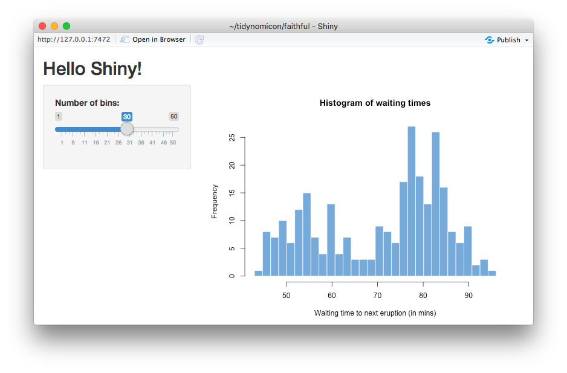
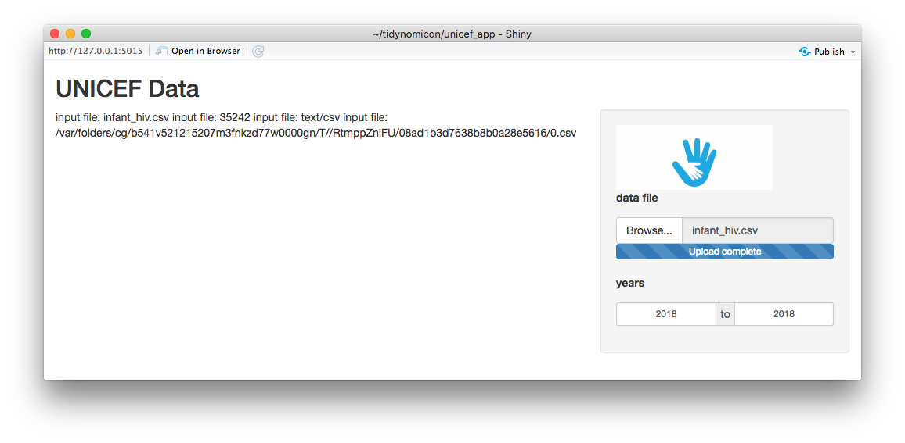

# Web Applications {#shiny}

```{r setup, include=FALSE}
source("etc/common.R")
```

Sooner or later,
almost every application needs a graphical interface
so that users can load data files, control parameters, and view results.
While the desktop still has a role to play,
the best place to build an interface these days is on the web,
and the best toolkit for doing that in R is [Shiny][shiny].
This lesson will walk through the construction of a simple application
and along the way introduce you to [reactive programming](glossary.html#reactive-programming).
To follow along,
please install Shiny using:

```{r eval=FALSE}
install.packages("shiny")
```

```{r eval=FALSE}
library(shiny)
```

## Learning Objectives

- Describe the three essential parts of a Shiny application.
- Explain how element names are used to connect interface elements to server actions.
- Describe the structure of a simple Shiny application and how to run it.
- Explain what reactive variables are and how they differ from normal variables.
- Use functions to create and style HTML elements.
- Explain how to avoid circular updates in interfaces.

## How do I set up a simple application?

Every Shiny app has three things:

1.  A user interface object that shows things to user.
2.  A server function, which is the back end that provides data.
3.  A call to `shinyApp` that binds the two together.

These can all live in the same file,
but most developers prefer to put the UI and server code in separate files.

To start,
we will reproduce the first example from [the Shiny tutorial](https://shiny.rstudio.com/tutorial/).
The first step is to create a directory called `faithful`:
we *must* do this because every Shiny application needs to be in its own directory.
Inside that directory,
create a file called `app.R`.
The function call `runApp(directory_name)` automatically looks in the named directory for a file with that name.

Inside `app.R`, we can create the skeleton of the application:

```{r eval=FALSE}
library(shiny)

ui <- # ...user interface...

server <- # ...server...

shinyApp(ui = ui, server = server)
```

Our next tasks are to fill in the user interface and server.

### Creating a user interface

Our interface is a [fluid page](glossary.html#fluid-page),
i.e., it resizes as needed based on the size of the browser.
It uses a single sidebar layout with two elements, `sidebarPanel` and `mainPanel`.
The sidebar contains a `sliderInput` object that (as you'd expect from the name) creates a slider;
we must specify `label`, `min`, `max`, and `value` to set it up.
We must also specify a value for `inputId`;
this gives the widget a name so that we can refer to it in the server code.

Finally,
our interface's `mainPanel` contains a single `plotOutput`
whose `outputId` attribute is used to refer to it.
The whole thing looks like this:

```{r eval=FALSE}
ui <- fluidPage(
  titlePanel("Hello Shiny!"),
  sidebarLayout(
    sidebarPanel(
      sliderInput(inputId = "bins",
                  label = "Number of bins:",
                  min = 1,
                  max = 50,
                  value = 30)),
    mainPanel(
      plotOutput(outputId = "distPlot"))
  )
)
```

(We could fit the `plotOutput` call on the same line as the call to `mainPanel`,
but it's easier to see the structure of the interface
if each level of logical nesting is reflected in the layout of the code.)

### Creating a server

In any interactive application,
something has to react to changes in controls and update displays.
Shiny watches for the former and takes care of the latter automatically,
but only once we tell it what to watch and how to make updates.
We do this by creating a function called `server`
that Shiny calls on our behalf whenever something in the interface changes:

```{r eval=FALSE}
server <- function(input, output) {
  output$distPlot <- renderPlot({
    x    <- faithful$waiting
    bins <- seq(min(x), max(x), length.out = input$bins + 1)
    hist(x, breaks = bins, col = "#75AADB", border = "white",
         xlab = "Waiting time to next eruption (in mins)",
         main = "Histogram of waiting times")
    })
}
```

When there is a change in one of the input elements,
Shiny notices and calls our function,
giving it a named list of inputs (i.e., our controls) and another of outputs (our displays).
For example,
since we gave our slider the ID `bins`,
`input$bins` will be the value of the slider.
Similarly,
`output$distPlot` matches the ID of the plot,
so we can use Shiny's `renderPlot` function to tell it what to plot.
(We can't use ggplot2 calls directly, but the terminology is very similar.)

### Running the application

We can now run `app.R` from the command line or use:

```{r eval=FALSE}
runApp("faithful")
```

from the RStudio console.
Once the application is running,
we can narrow the window to see things automatically resize
(the "fluid" part of the interface).
The `x` axis is waiting times from the `faithful` data,
the `y` axis shows the frequency of that waiting time,
and the control in the upper left lets us change the sizes of the bins.

```{r}

```

## How can I build a more interesting interface?

Let's trying building a tool for exploring the UNICEF data we tidied up in previous chapters.
To start,
we `mkdir unicef/skeleton` and create `app.R`:

<!-- unicef/skeleton/app.R -->
```{r eval=FALSE}
library(shiny)

ui <- fluidPage(
  titlePanel("UNICEF Data"),
  sidebarLayout(
    position = "right",
    sidebarPanel(
      img(src = "logo.png", width = 200),
      h2("Controls")
    ),
    mainPanel(
      h1("Display"))
  )
)

server <- function(input, output){
  # Empty for now.
}

shinyApp(ui = ui, server = server)
```

Running this with `runApp('unicef/skeleton')` gives us:

```{r}
knitr::include_graphics("figures/shiny/unicef-skeleton.png")
```

This has a title panel,
controls on the right,
and some space for a display on the left.
We use `h1`, `h2`, and similarly-named functions to create HTML elements
and `img` to display a logo.
The server is empty for now: we will fill that in below.

When we run this for the first time everything looks good except the image,
because it turns out that [static images](glossary.html#static-image) must be in the application's `www` folder,
i.e.,
in `unicef/skeleton/www`.
Once we put `logo.png` there, everything looks as it should.

It's now time to add interactive control elements, better known as [widgets](glossary.html#widget).
Shiny provides:

-   buttons
-   checkboxes
-   radio buttons
-   pulldown selectors (for cases when checkboxes or radio buttons would take up too much space)
-   date inputs and date ranges
-   filenames
-   sliders (like the one seen before)
-   free-form text input

That's a lot of options;
since we don't have a user to consult,
we need to decide what we're going to visualize.
One obvious choice is to allow people to choose a data file,
and then select a data range based on the years in that file
and see a line plot of the average estimate by year.
After replacing the `h2` element with a `fileInput` and `dateRangeInput` elements in `unicef/prototype/app.R`,
our application looks like this:

<!-- unicef/prototype/app.R -->
```{r eval=FALSE}
ui <- fluidPage(
  titlePanel("UNICEF Data"),
  sidebarLayout(
    position = "right",
    sidebarPanel(
      img(src = "logo.png", width = 200),
      fileInput("datafile", p("data file")),
      dateRangeInput("years", p("years"), format = "yyyy")
    ),
    mainPanel(
      h1("Display"))
  )
)
```

```{r}
knitr::include_graphics("figures/shiny/unicef-prototype.png")
```

Let's show the chosen filename in the output display:

<!-- unicef/filename_wrong/app.R -->
```{r eval=FALSE}
ui <- fluidPage(
  titlePanel("UNICEF Data"),
  sidebarLayout(
    # ...as before...
    mainPanel(
      textOutput("filename")
    )
  )
)

server <- function(input, output){
  output$filename <- renderText({
    paste("input file:", input$datafile)
  })
}
```

The initial display looks good:

```{r}
knitr::include_graphics("figures/shiny/unicef-filename-wrong-before.png")
```

but when we fill in the filename, something is clearly wrong:

```{r}

```

A quick browse of the documentation reveals that
`input$datafile` is actually a dataframe containing several values.
What we actually want is `input$datafile$datapath`:

<!-- unicef/filename_right/app.R -->
```{r eval=FALSE}
server <- function(input, output){
  output$filename <- renderText({
    paste("input file:", input$datafile$datapath)
  })
}
```

but this *still* looks wrong after upload:

```{r}
knitr::include_graphics("figures/shiny/unicef-filename-almost-right.png")
```

Some more digging reveals that we should display `name` but use `datapath` when reading data:

```{r}
knitr::include_graphics("figures/shiny/unicef-filename-right.png")
```

"It's still better than LaTeX," we mutter, and continue.

### Enhancing the server

Let's fill in the server a bit:

<!-- unicef/server/app.R -->
```{r eval=FALSE}
server <- function(input, output){
  currentData <- NULL
  output$filename <- renderText({
    currentName <- input$datafile$name
    currentPath <- input$datafile$datapath
    if (is.null(currentName)) {
      currentData <- NULL
      text <- "no filename set"
    } else {
      currentData <- read_csv(currentPath)
      text <- paste("showing", currentName)
    }
    text
  })
}
```

### Which variables belong where

This short program shows three places that we can put code:

1.  **Outside the calls to `ui` and `server`.**
    Code placed here is run once when the application launches,
    so this is a good place to (for example) set up a database connection.

2.  **Inside `server`.**
    Code placed here is run once *for each new [session](glossary.html#session)*.
    Each time someone makes a fresh connection to the application,
    Shiny starts a new server so that each user's work will be isolated from their peers.
    If the application needs to store the current state of an analysis,
    the dataframe used for that purpose should be created here.

3.  **Inside a handler like `renderText`.**
    Code placed here is re-run each time the handler is triggered by a change in the user interface,
    so short-lived scratchpad variables should be declared here.

## How can I display the data in a file?

Now comes the hard part: updating the chart when the file changes.
The trick is to use a [reactive variable](glossary.html#reactive-variable),
which is actually a function that changes value whenever something it depends on changes.
That "something" is usually another reactive,
like the ones provided by Shiny.

In the code below,
`currentData` is created by calling `reactive` with a block of code that produces the variable's value.
It uses `input$datafile`,
so it will automatically be triggered whenever `input$datafile` changes.
Other things can depend on it in the same way,
which allows us to get rid of `currentData`:
`output$filename` uses `currentData()`,
so it is automatically called when the reactive variable's value changes.

<!-- unicef/reactive_update/app.R -->
```{r eval=FALSE}
server <- function(input, output){
  currentData <- reactive({
    currentPath <- input$datafile$datapath
    if (is.null(currentPath)) {
      result <- NULL
    } else {
      result <- read_csv(currentPath)
    }
    result
  })

  output$filename <- renderText({
    currentName <- input$datafile$name
    if (is.null(currentName)) {
      text <- "no filename set"
    } else {
      text <- paste("showing", currentName)
    }
    text
  })

  output$chart <- renderPlot({
    data <- currentData()
    if (is.null(data)) {
      message("no data")
      chart <- NULL
    } else {
      message("we have data, creating chart")
      chart <- data %>%
        group_by(year) %>%
        summarize(average = mean(estimate, na.rm = TRUE)) %>%
        ggplot(mapping = aes(x = year, y = average)) +
        geom_line()
    }
    chart
  })
}
```

```{r echo=FALSE}
if (knitr::is_latex_output()){
  knitr::include_graphics("figures/shiny/unicef-reactive-update.png")
} else {
  knitr::include_graphics("figures/shiny/unicef-reactive-update.gif")
}
```

## How can I break circular dependencies?

Now comes the *other* hard part: handling changes to the date range.
We want the chart to display data for the selected range of years
and have the minimum and maximum possible year set by the data.
That means we have to change something in the user interface from the server;
to do that,
we add a third parameter `session` to the `server` function.
This variable holds the backward connection from the server to the UI.

Inside our server,
we get the current years from `input$years`
and use `updateDateRangeInput` to push a change from the output function to the input controls.
(This is the part that needs `session`.)

<!-- unicef/infinite_update/app.R -->
```{r eval=FALSE}
server <- function(input, output, session){
  # ...other code as before...

  output$chart <- renderPlot({
    years <- input$years
    message('years', years)
    data <- currentData()
    if (is.null(data)) {
      chart <- NULL
    } else {
      minYear <- as.character(min(data$year))
      maxYear <- as.character(max(data$year))
      updateDateRangeInput(session, "years", min = minYear, max = maxYear,
                           start = minYear, end = maxYear)
      chart <- data %>%
        group_by(year) %>%
        summarize(average = mean(estimate, na.rm = TRUE)) %>%
        ggplot(mapping = aes(x = year, y = average)) +
        geom_line() +
        ggtitle(paste("Years", minYear, "-", maxYear))
    }
    chart
  })
}
```

When we run this,
it displays the current date twice on startup before a file is selected because that's the default for the date input.
Once dates are entered,
though,
it goes into an infinite loop because
ghe chart depends on the dates,
but we're changing the dates inside the plot update.

Let's try again.
We will just read `years` inside the chart update and display it:

<!-- unicef/every_character/app.R -->
```{r eval=FALSE}
  output$chart <- renderPlot({
    years <- input$years
    message('years', years)
    data <- currentData()
    if (is.null(data)) {
      chart <- NULL
    } else {
      minYear <- as.character(min(data$year))
      maxYear <- as.character(max(data$year))
      chart <- data %>%
        group_by(year) %>%
        summarize(average = mean(estimate, na.rm = TRUE)) %>%
        ggplot(mapping = aes(x = year, y = average)) +
        geom_line() +
        ggtitle(paste("Years", minYear, "-", maxYear))
    }
    chart
  })
```

Whoops:
the message appears every time a character is typed in one of the date controls,
i.e.,
deleting the start year and typing `2`, `0`, `1`, `8`
produces `0002`, `0020`, and `0201` before producing a usable year.
That's clearly not what we want,
so we'll try a third approach
and only show the year selector when there's data.
While we're doing this,
we'll change the year selector to a double-ended slider, because seeing the day and month is misleading.
The revised UI code looks like this:

<!-- unicef/slider/app.R -->
```{r eval=FALSE}
ui <- fluidPage(
  titlePanel("UNICEF Data"),
  sidebarLayout(
    position = "right",
    sidebarPanel(
      img(src = "logo.png", width = 200),
      div(
        id = "datafileInput",
        fileInput("datafile", p("data file"))
      )
    ),
    mainPanel(
      p(textOutput("filename")),
      plotOutput("chart")
    )
  )
)
```

Here, we have wrapped the file selector in a `div`
so that we have a named element after which to insert our date range selector,
but *haven't* included the date range selector (yet).

The outline of the corresponding server is:

```{r eval=FALSE}
server <- function(input, output){

  currentData <- reactive({
    # ...provide currentData...
  })
  
  selectedData <- reactive({
    # ...provide selectedData...
  })
  
  observeEvent(input$datafile, {
    # ...insert year selector when datafile changes...
  })
  
  output$chart <- renderPlot({
    # ...update chart when selectedData changes...
  })
  
  output$filename <- renderText({
    # ...update displayed filename when selected file changes...
  })
}
```

The zero'th change is getting rid of the `session` variable:
we don't need it any longer because we're not modifying the interface from the server.
The first change is to create a reactive variable for the selected data.
We need this because the chart depends on the selected data,
while the range of years we can select depends on the current (actual) data.
As a rule,
everywhere we might need to "see" data,
we should create a reactive variable.

The function `observeEvent` allows us to create event handlers that aren't directly attached to display objects;
we need one so that we can create the year display.
Once that's set up,
`currentData` is straightforward:
if the filename changes, load that CSV file:

```{r eval=FALSE}
  currentData <- reactive({
    read_csv(input$datafile$datapath)
  })
```

`selectedData` is also straightforward:
if `currentData` changes, filter by year range:

```{r eval=FALSE}
  selectedData <- reactive({
    req(input$years)
    currentData() %>%
      filter(between(year, input$years[1], input$years[2]))
  })
```

This function uses `currentData()` so that Shiny knows it depends on changes to the current data.
But how do we know we *have* a year range?
The answer is that `req(input$years)` means "make sure this thing exists before going any further".
Once we have the years, we can filter as required.

Now for the clever bit:
we will create a slider *after* loading a data file.
More specifically,
we will use `observeEvent(input$datafile, {...})` to indicate that this action depends on changes to the filename,
then get the current data,
grab the year range,
create a `sliderInput`,
and use `insertUI` to add it after the `div` we created:

```{r eval=FALSE}
  observeEvent(input$datafile, {
    current <- currentData()
    lowYear <- min(current$year)
    highYear <- max(current$year)
    insertUI(
      selector = "#datafileInput",
      where = "afterEnd",
      ui = sliderInput("years", "years", 
                       min = lowYear,
                       max = highYear,
                       value = c(lowYear, highYear),
                       sep = "")
    )
  })
```

Creating the chart and displaying the filename is done as before,
though we have switched to `ifelse` for the filename's value to be idiomatic.
Note that the chart depends on `selectedData()` and *not* the raw data:

```{r eval=FALSE}
  output$chart <- renderPlot({
    selectedData() %>%
      group_by(year) %>%
      summarize(average = mean(estimate, na.rm = TRUE)) %>%
        ggplot(mapping = aes(x = year, y = average)) +
        geom_line() +
        labs(title = paste("Years", input$years[1], "to", input$years[2]))
  })
  
  output$filename <- renderText({
    currentName <- input$datafile$name
    ifelse(is.null(currentName), "no filename set", paste("showing", currentName))
  })
```

Here are the dependencies we have created:

```{r}
knitr::include_graphics("figures/shiny/unicef-slider-dependencies.png")
```

It works!
Except that we're adding a slider every time we open a file,
so if we open the same file twice, we get two sliders with identical ranges:

```{r}
knitr::include_graphics("figures/shiny/unicef-slider.png")
```

## How can I control how the user interface is rendered?

Our last refinement uses `uiOutput` and `renderUI` to (re-)create the slider at just the right moment.
The UI looks familiar,
except there's a `uiOutput` placeholder where the slider is to go—its name "slider"
will be used in the server:

```{r eval=FALSE}
ui <- fluidPage(
  titlePanel("UNICEF Data"),
  sidebarLayout(
    position = "right",
    sidebarPanel(
      img(src = "logo.png", width = 200),
      fileInput("datafile", p("data file")),
      uiOutput("slider")
    ),
    mainPanel(
      p(textOutput("filename")),
      plotOutput("chart")
    )
  )
)
```

`uiOutput` is always used in conjunction with `renderUI` in the server,
so let's look at the server:

```{r eval=FALSE}
server <- function(input, output){

  currentData <- reactive({
    # ...get the data...
  })

  output$slider <- renderUI({
    # ...create a widget to allow year selection...
  })

  selectedData <- reactive({
    # ...select data using values from the year selector...
  })

  output$chart <- renderPlot({
    # ...draw the chart...
  })

  output$filename <- renderText({
    # ...display the filename...
  })
}
```

What does `currentData` look like?

```{r eval=FALSE}
  currentData <- reactive({
    req(input$datafile)
    read_csv(input$datafile$datapath)
  })
```

We use `req(...)` to tell Shiny that there's no point proceeding unless `input$datafile` actually has a value,
because we can't load data if we have a `NULL` filename.

Once we have data,
we create a slider or overwrite the existing slider if there already is one;
this prevents the problem of multiple sliders.
Note that the slider's ID is `"years"`
and that its range is set based on data,
so we avoid the problem of having to create a slider when we don't know what its range should be:

```{r eval=FALSE}
  output$slider <- renderUI({
    current <- currentData()
    lowYear <- min(current$year)
    highYear <- max(current$year)

    sliderInput("years", "years",
                     min = lowYear,
                     max = highYear,
                     value = c(lowYear, highYear),
                     sep = "")
  })
```

Once we have a slider,
we select the data;
this depends on the years from the slider,
so we make that explicit using `req`:

```{r eval=FALSE}
  selectedData <- reactive({
    req(input$years)

    currentData() %>%
      filter(between(year, input$years[1], input$years[2]))
  })
```

Displaying the chart and the filename are exactly as we've seen before:
the chart depends on `selectedData`
and the filename display depends on `input$datafile$name`.

So how and why does this all work?

1.  When the UI is initially created:
    -   There is no data file, so `req(input$datafile)` in the definition of `currentData` halts.
    -   Without `currentData`, the `renderUI` call used to create the slider doesn't proceed.
    -   So the UI doesn't get a slider and doesn't try to display data it doesn't have.

2.  When a filename is selected for the first time:
    -   `input$datafile` gets a value.
    -   So we load data *and* we can display the filename.
    -   `currentData` now has a meaningful value.
    -   So we can create a slider *and* initialize its limits to the min and max years from the actual data.
    -   So `selectedData` can now be constructed (all of the things it depends on exist).
    -   So we can draw the chart.

3.  When a new file is selected:
    -   `input$datafile` gets a value.
    -   So we load data and display the filenmae.
    -   `currentData` is then re-created.
    -   So we replace the slider with a new one whose bounds are set by the new data.
    -   And then construct `selectedData` and draw the chart.

This isn't the only way to build our interface,
but the alternatives use more advanced functions like `freeze` and are harder to debug.
The way to get where we want to is to break everything down into single actions,
each of which is probably smaller than we might first expect.
It takes a bit of practice,
but once you're used to it,
you'll be able to build some powerful tools with just a page or two of code.

## Key Points
```{r, child="keypoints/shiny.md"}
```

```{r, child="etc/links.md"}
```
